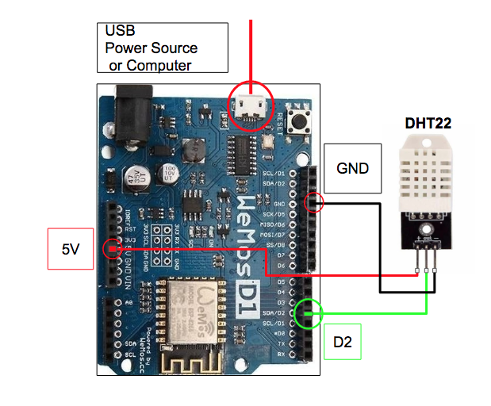

# Sensor setup using ESP8266 and DHT22

## Requirements

### Hardware Requirements
* ESP8266
* DHT22
* Circuit Board
* Wires to connect ESP to Circuit Board
* USB power cable to connect to ESP

### Software Requirements

* [Arduino IDE](https://www.arduino.cc/en/Main/Software)

## Getting The Sensors Up And Running

#### Arduino prerequisites
1. Install Library - 
2. Install Library -  

#### WEMOS D1

1. Connect the DHT22 to your ESP.  
 

3. Copy and paste [firmware](https://gitlab.com/german.martinez/black-forest-firmware/blob/master/DHT22Esp.ino) into your Arduino IDE.

[this tutorial](https://randomnerdtutorials.com/esp8266-dht11dht22-temperature-and-humidity-web-server-with-arduino-ide/). You only need to follows the directions under the headers "ESP8266 and DHT11/DHT22 Schematic Diagram" and "Installing the DHT Library for ESP8266".
2. Copy and paste [firmware](https://gitlab.com/german.martinez/black-forest-firmware/blob/master/DHT22Esp.ino) into your Arduino IDE.
3. In lines 15 and 16, change the ssid and password to match your wifi ssid/name and your wifi password.
4. Click the upload button.
5. You should see debug statements in the terminal letting you know that the ESP has connected to your wifi.
