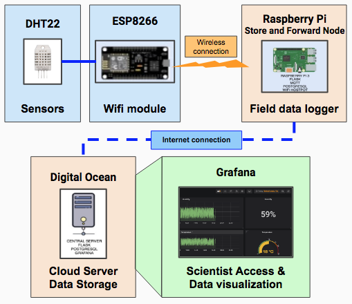
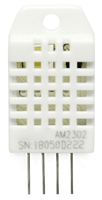
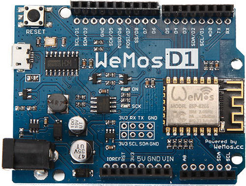
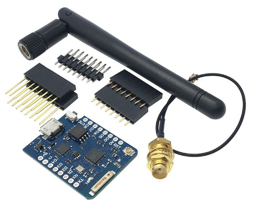
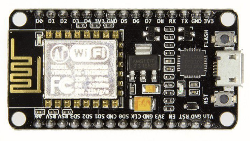

# Black Rock Forest Store and Forward Node Project

The Black Rock Forest Store and Forward Node Project is a solution to provide network data loggers for enviornmental sensors that can be used in conjunction with the Black Rock Forest Wifi Mesh network.  

The Store and Forward nodes are data logging Raspberry Pi based servers that are located in the forest. These field base RPi Store and Forward nodes are developed to records sensor data, store locally on a database, and passes it along to each node in the network until it arrives at the Central Store and Forward server in the cloud. The system is configure to recieve sensor data from ESP8266 based chips.  For this documentation the ESP8266 sensor nodes use DHT22 temperature and humidity sensors.  

At one end of the network, are one or more sensors. Those sensors can connect to a Raspberry Pi or local server if connected to a LAN, or a remote server if connected to the Internet. The data is also avaliable to be visualized using Grafana, an application wich is also avaliable in the store and forward node deployment packages that are part of this repository. 
All of our testing has been done with:

- ESP8266 - WEMOS D2 
- DHT22 
- Raspberry Pi 3B+ 
- Digital Ocean Droplet - Ubuntu 18.04
- Grafana V.x

It is important to note that each of these layers are completely decoupled. They work via message passing, as you'll see in the documentation below. In other words, you don't need to use the sensors we used, nor do you need to use a Raspberry Pi, or even Digital Ocean. Any device that's at least as powerful as a Raspberry Pi 3 can host this code and serve as a store and forward node. Any device can send data to the store and forward nodes as well.

The directions below detail how we set up our network, and how you can follow along. 

## Understanding the Architecture

The Store and Forward node system is made up of 4 compnents:
- 1 The Sensor (DHT22)
- 2 the ESP8266 Microcontroller (WEMOS D1) 
- 3 The Raspberry Pi with Store and Forward Node Software 
- 4 Cloud Server with Store and Forward Node Software and running Grafana

## Getting Started: Hardware and Server

### DHT22 

A DHT22 is a basic, low-cost digital temperature and humidity sensor. It uses capacitive humidity sensor and a thermistor to measure the surrounding air, and outputs a digital signal on the data pin (no analog input pins needed). [DHT22 is avaliable at adafruit.](https://www.adafruit.com/product/385)

### ESP8266 
The ESP8266 is a low-cost Wi-Fi microchip with full TCP/IP stack and microcontroller capability that can be programed using Arduino IDE. It comes in several flavors, and for this project we used the

**WEMOS D1**

    

**WEMOS d1 mini Pro (with external antenna)**

       

**NODEMCU**

 

[More information on ESP8266](http://esp8266.net/). [You can purchase ESP8266 here]

#### //ADD PICTURE
#### //ADD DESCRIPTION
[Raspberry Pi](https://www.raspberrypi.org/)

#### //ADD PICTURE
#### //ADD DESCRIPTION
[Digital Ocean](https://www.digitalocean.com/)

### How To Guides
The how to guides are broken down into 3 major componenets of the Store and Forward Node system. 

[Sensor Guide](./docs/esp8266.md) The Sensor guide has instructions on how to use WEMOS D1 ESP8266 microcontroller and a DHT22 and connect them to a Store and Forward network.  

[Main App Guide](./docs/main_app.md) Is a step by step instructions for setting up as a store and forward server on either a Raspberry Pi or a Cloud based server.

[Grafana Store and Forward Guide](./docs/grafana.md) provides instructions for visualizing data from Sensors on a Grafana, an open source visulaization platform.  

### FAQ & Troubleshooting
[FAQ and troubleshooting](./docs/faq-troubleshooting.md) will provide users answers to common questions, and ways to debug the Store and Forward system.  

